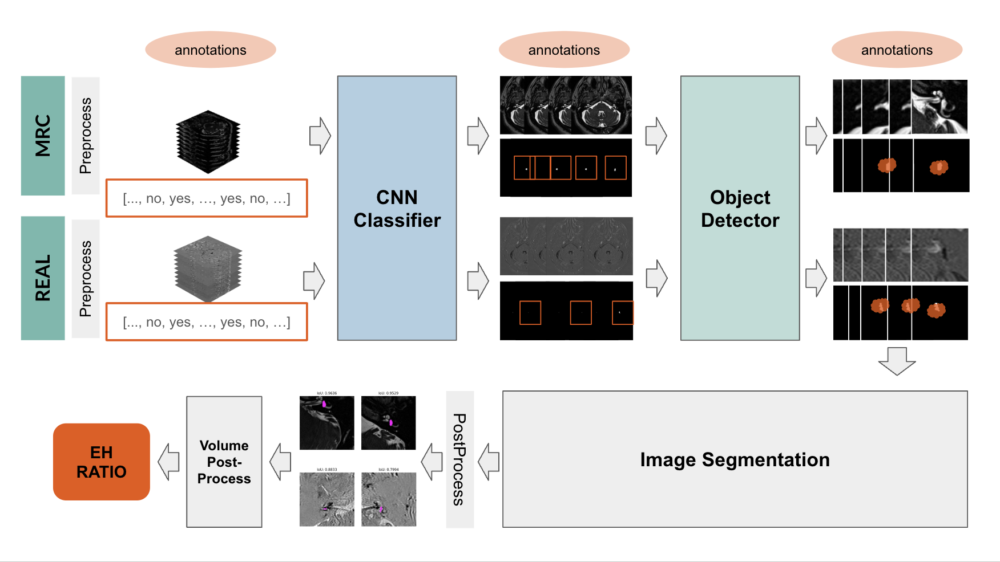

# Multi-Network Segmentation Pipeline for EH Ratio Analysis

This project implements a full pipeline for image processing and segmentation, integrating three different neural networks to achieve a final segmentation output. The pipeline is designed to analyze both MRC and REAL datasets, process their volumetric images, classify regions of interest, and segment specific areas to compute the EH ratio. The ultimate goal is to provide an end-to-end solution for automated medical image analysis.

---

## **Network Structure**

Below is the architecture of the complete pipeline:



--- 

## **Folder Structure**

Below is the folder structure for the GitHub repository, designed to streamline development and testing:
```
root/
├── dataloader/
│   └── dataloader.py   # Classes for loading MRC and REAL images with labels for classification, ROIs, and segmentation.
├── models/
│   ├── classificator/  # Folder to store classification models. 
│   │   └── five_layer_cnn_PEI.py    # Five layer CNN for PEI image classification.
│   │   └── five_layer_cnn.py    # Five layer CNN for MRC image classification.
│   │   └── resnet50.py    # Pretrained ResNet model for MRC and PEI images. 
│   ├── object_detector/  # Folder to store object detection models.
│   └── segmentator/     # Folder to store segmentation models.
├── trainers/
│   ├── classificator/
│   │   └── __init__.py    
│   │   └── toy_classificator.py    # Training and evaluation functions for the classifier.
│   ├── object_detector/
│   │   └── __init__.py  
│   │   └── yolo_trainer.py  # Training and evaluation functions for object detection.
│   └── segmentator/
│   │   └── __init__.py  
│   │   └── pretrained_trainers.py      # Training and evaluation functions for segmentation.
├── utils/
│   ├── EHRatioCalculator.py    # Utility to calculate the EH ratio from segmentation results.
│   ├── metrics.py              # Common metrics for evaluation (e.g., Dice score, IoU).
│   └── plots.py                # Visualization tools for predictions and results.
├── losses/
│   └── losses.py    # Custom loss functions for segmentation, object detection, and classification tasks.
├── results/    # Folder to store results, organized by timestamps.
│   ├── results_classificator/  # Classification results.
│   │   ├── results_classificator_MRC/  # Results for MRC dataset classification.
│   │   ├── results_classificator_PEI/  # Results for PEI dataset classification.
│   ├── results_segmentator/  # Segmentation results.
│   │   ├── results_segmentator_MRC/  # Results for MRC dataset segmentation.
│   │   ├── results_segmentator_PEI/  # Results for PEI dataset segmentation.
├── toy_dataset/    # Test dataset with MRC images for debugging and prototyping (not included in the repository).
├── main_segmentator.py      # Main script to train and evaluate the segmentation network.
├── main_object_detector.py  # Main script to train and evaluate the object detection network.
├── main_classificator.py    # Main script to train and evaluate the classification network.
└── main.py    # Final pipeline script integrating all three networks with pretrained weights.

```
# Final pipeline script integrating all three networks with pretrained weights
---

## **Pipeline Components**

### **1. Preprocessing**
- Images from MRC and REAL datasets are preprocessed.
- Outputs include:
  - Volumetric images.
  - Slice-level labels for classification.
  - Region of Interest (ROI) labels for object detection.
  - Surface labels for segmentation tasks.

### **2. CNN Classifier**

**Data Requirements** 

Before running the classification pipeline, ensure that the `data` directory contains an annotation file in `.xlsx` format. This file is required by `main_classificator.py` and `main_classificator_PEI.py` for proper execution.

- Classifies slices into "ear" and "non-ear".
- Designed for robust performance across MRC and REAL datasets.
- Model details are implemented in `models/classificator.py`.
- The classification step can be performed using either:a **5-layer CNN** or a **ResNet50** model.

To train the classification model, use the following command:

```bash
python main_classificator.py --model resnet50
```
or
```bash
python main_classificator.py --model cnn
```
### **3. Object Detector**
- Detects regions of interest in classified "ear" slices.
- Outputs bounding boxes for regions containing relevant structures.
- Model details are implemented in `models/object_detector.py`.

### **4. Image Segmentation**
- Segments the detected regions into fine-grained areas of interest.
- Outputs masks to compute metrics like Dice score, IoU, and the EH ratio.
- Model details are implemented in `models/segmentator.py`.

### **5. Post-Processing**
- Volume-based refinement of segmentation results.
- Computation of the EH ratio using `utils/EHRatioCalculator.py`.

---

TBC

