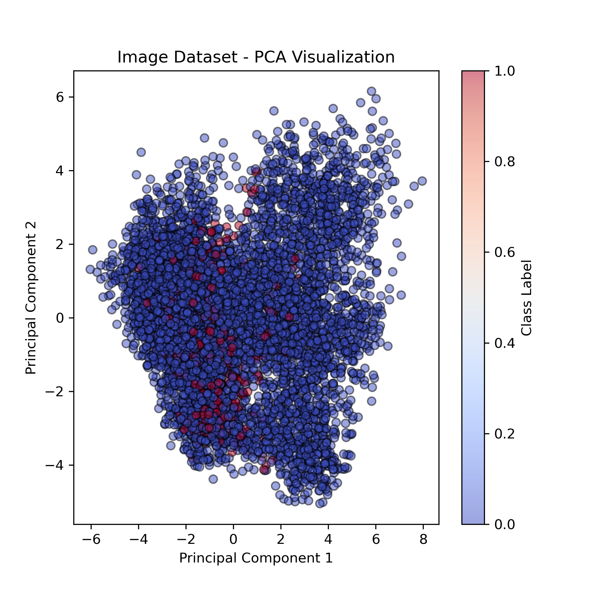
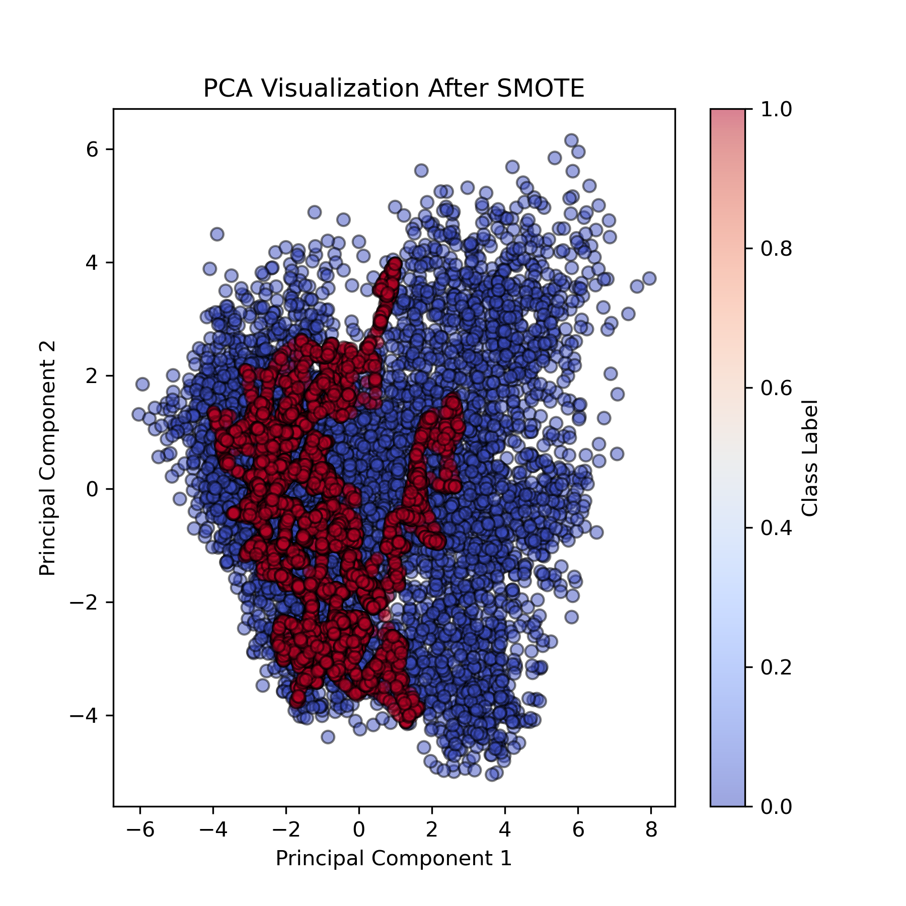

# **PCA Analysis & SMOTE Evaluation for Class Imbalance**

## **Overview**
This experiment investigates the class imbalance problem in our dataset using **PCA visualization** and evaluates the impact of **SMOTE oversampling** on **SVM classification performance** for **PEI images**. The results compare the model's performance **with and without SMOTE** to determine how oversampling affects classification accuracy.

---

## **1️⃣ PCA Visualization of the Dataset**
We reduced the **image feature space** to **2D** using **Principal Component Analysis (PCA)** to observe the class distribution before and after applying **SMOTE**.

### 🔹 **Original Dataset (Before SMOTE)**

- The dataset is **highly imbalanced** (Class 0 dominates).
- The SVM classifier **ignored Class 1 entirely** in this setting.

### 🔹 **SMOTE Oversampled Dataset**

- SMOTE **balanced the class distribution**, making Class 1 more visible.
- The SVM classifier was forced to **learn from both classes**.

---

## **2️⃣ Classification Results**
| **Metric**  | **Without SMOTE** | **With SMOTE** | **Change** |
|-------------|------------------|----------------|------------|
| **Accuracy** | **94%** | **65%** | 📉 Drops (expected, as model now recognizes class 1) |
| **Class 0 Recall** | **100%** | **43%** | 📉 Model is misclassifying class 0 more |
| **Class 1 Recall** | **0%** | **86%** | 📈 Massive improvement! Model now detects class 1 |
| **Class 1 Precision** | **0%** | **60%** | 📈 Model now predicts class 1 correctly |

### **🔹 Classification Report WITHOUT SMOTE**
```yaml
          precision    recall  f1-score   support

       0       0.94      1.00      0.97      6416
       1       0.00      0.00      0.00       416

accuracy                           0.94      6832
macro avg 0.47 0.50 0.48 6832 weighted avg 0.88 0.94 0.91 6832
```
➡️ **Class 1 is completely ignored** by the model because the dataset is **highly imbalanced**.
---
### **🔹 Classification Report WITH SMOTE**
```yaml
          precision    recall  f1-score   support

       0       0.75      0.43      0.55      6416
       1       0.60      0.86      0.71      6416

accuracy                           0.65     12832
macro avg 0.68 0.65 0.63 12832 weighted avg 0.68 0.65 0.63 12832
```
➡️ **Class 1 recall improved from 0% to 86%!** However, **Class 0 recall dropped significantly**, meaning many Class 0 samples were misclassified as Class 1.

---

## **3️⃣ Conclusions**
- **Without SMOTE**:  
  - The SVM model completely **ignored Class 1**, resulting in misleadingly **high accuracy (94%)**.
  - This is **not a good classifier**, as it fails to detect minority class cases.

- **With SMOTE**:  
  - **Class 1 recall improved dramatically (0% → 86%)**, meaning the model now detects Class 1 well.
  - **Class 0 recall dropped (100% → 43%)**, meaning the model now misclassifies some Class 0 cases.
  - **Overall accuracy decreased (94% → 65%)**, but this is expected since the model is no longer biased.

---

## **4️⃣ Next Steps & Recommendations**
✅ **Try Hybrid Sampling (SMOTE + Undersampling)**  
- **Current issue**: While SMOTE helped Class 1 recall, it caused **Class 0 misclassification**.  
- **Solution**: Use **SMOTE + Undersampling (SMOTEENN)** to balance both classes:
  ```python
  from imblearn.combine import SMOTEENN
  smote_enn = SMOTEENN(random_state=0)
  X_train_balanced, y_train_balanced = smote_enn.fit_resample(X_train_pca, y_train)
  ```
- This method **adds synthetic samples to Class 1** while also removing some samples from Class 0 to avoid overfitting to synthetic data.

✅ Evaluate ROC Curves & Precision-Recall Curves
- If false positives (Class 0 misclassified as Class 1) are problematic, we may need cost-sensitive learning or adjust thresholds.

✅ Apply to ResNet50 network
- **Repeat the experiment** using **ResNet50 features** to see if the results are consistent across different feature extraction methods.
